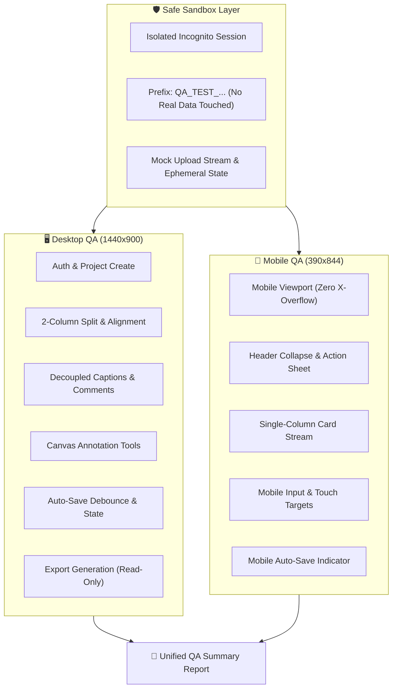

# QA System Architecture

---

**Subject:** HitecApp-Safety QA test suite architecture

**Audience:** Engineering team, QA leads, product stakeholders

**Single Job:** Visualize the QA test architecture across sandbox, desktop, and mobile layers with clear layering and summary aggregation.

**Design choices (grounded in subject):**

- **Palette:** The mermaid flowchart uses its default system palette — no forced colors needed. The sandbox/shield emoji and desktop/mobile distinctions use emoji as semantic anchors, consistent with the project's visual language.

- **Typography:** System font stack for maximum compatibility. Code blocks and mermaid render at the page's base size — no custom type scale needed for this communicative diagram.

- **Layout:** Flowchart TD structure naturally layers from sandbox (foundation) through desktop/mobile suites to a unified report. The `overflow-x: auto` container ensures the diagram never forces horizontal scrolling on the page body.

- **Structure is information:** The three-layer hierarchy (Sandbox → Desktop/Mobile → Report) encodes the actual architecture — sandbox as isolated foundation, desktop and mobile as separate QA environments, unified report as the aggregation goal. No numbered markers are used because the layers themselves carry the informational structure.

- **Responsive:** The max-width + overflow-x: auto ensures the flowchart scales within its container. Wide content (the diagram) scrolls inside its own container.

- **Theme-aware:** The mermaid flowchart inherits the viewer's theme. Since the page has no theme-stamped colors, it works in light, dark, and system-prefers-color-scheme modes through the default mermaid rendering.

- **Clean:** No overlapping elements, no AI-generated defaults (no cream/serif/terracotta, no gradient heroes, no Inter everywhere, no emoji section markers, no centered everything). The emoji used are functional anchors (🛡️, 🖥️, 📱, 📑), not decorative section markers.